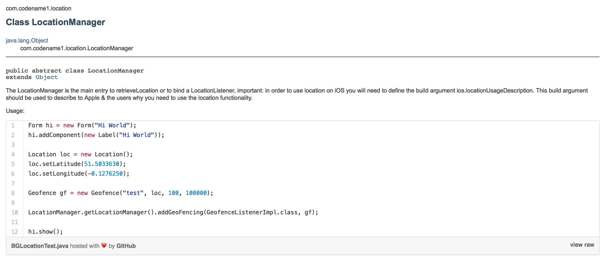
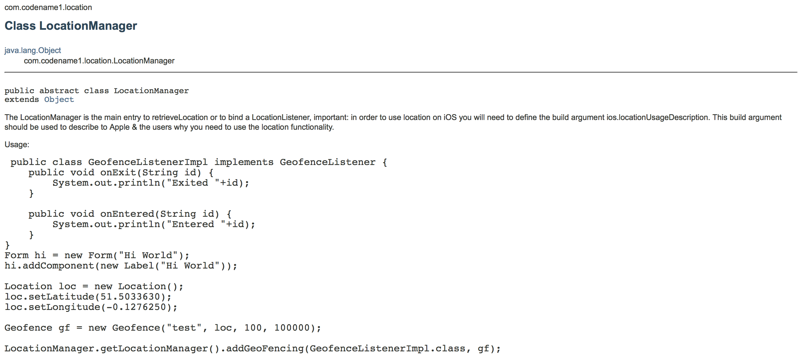

# JavaDoc Source Embed

JavaDoc is a wonderful tool with some annoying limitations, one of them is its inability to handle source code embeds. 
[Githubs gist](http://gist.github.com/) is an amazing tool for embeding source code but it requires JavaScript which means
it doesn't work with the popups in common IDE's and isn't as searchable. 

Gist makes source embedding trivial since you can embed a single sample in multiple methods/classes and manage the sample
itself in a centeral location. 

With this tool you can get JavaDoc that looks like this: https://www.codenameone.com/javadoc/com/codename1/location/LocationManager.html

With JavaScript enabled you see this:



Without JavaScript (or in IDE/search engine) you will see this:




The JavaDoc source embed tool allows you to use gist embeds directly in your javadoc without any change! When you 
generate JavaDoc it queries github for the gist contents and embeds it as a `<noscript>` 
alternative right into the code. This means IDE code completion will "just work" as it will have a sensible fallback.

Just pass the source directory and an output directory to the jar file and then generate the javadoc based on the output
directory.

E.g:

```bash
rm -Rf dist/javadoc
rm -Rf build/tempJavaSources
java -jar JavaDocSourceEmbed-1.0-SNAPSHOT.jar pathToSrcDir/src build/tempJavaSources

javadoc -protected -d dist/javadoc -windowtitle "Codename One API" build/tempJavaSources
```

Or using ant you can do something like:

```xml
<delete dir="temp/javadocsources" />
<java fork="true" jar="JavaDocSourceEmbed-1.0-SNAPSHOT.jar">
    <arg file="src" />
    <arg file="temp/javadocsources" />
</java>
<javadoc author="Me Me Me Me" protected="true" windowtitle="My Great New API"  destdir="javadoc">
    <packageset dir="temp/javadocsources">
    </packageset>            
</javadoc>
```
